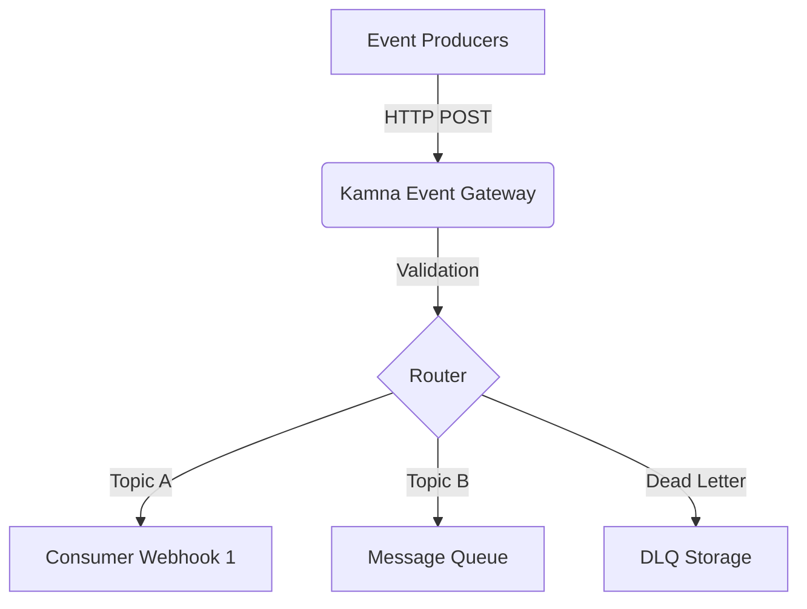

# Kamna Event Gateway

## Project Vision
Kamna Event Gateway is an independent infrastructure component designed for generic, reliable event routing. It serves as a foundational layer to decouple event producers and consumers, providing a highly available and performant gateway for infrastructural events.

## Why This Project Exists
Modern architectures require robust decoupling of event generation from event processing. Existing monolithic event handlers often intertwine business logic with infrastructure concerns, leading to fragile systems that are difficult to scale. Kamna Event Gateway provides a pure infrastructural layer that solely handles routing, retries, and delivery without knowing the specifics of the events it processes.

## Core Principles
1.  **Separation of Concerns**: Strictly decoupled from any specific business logic (e.g., ERP, CRMs).
2.  **Type Safety**: Fully typed with TypeScript and strict runtime validation via Zod.
3.  **Performance**: Built on Fastify to ensure minimal overhead and maximum throughput.
4.  **Observability**: Structured logging using Pino.
5.  **Agnosticism**: The gateway does not know the meaning of the payloads; it only understands routing keys and delivery semantics.

## Non-Goals
-   **Business Logic**: This service will never execute domain-specific logic.
-   **Data Transformation**: Events are delivered as-is; transformations should happen at the consumer level.
-   **Integration Specifics**: It will not contain code specific to WhatsApp, Zoho, or any other third-party platform.

## Architecture Philosophy
The gateway acts as a dumb pipe with smart endpoints. It accepts events via HTTP/REST (or other transports in the future), validates the outer envelope, and routes them to configured consumers via Webhooks or Message Queues.

## Folder Structure
- `src/app.ts`: Application factory and route registration.
- `src/server.ts`: Server entrypoint.
- `src/config/`: Configuration and environment validation.
- `src/plugins/`: Fastify plugins.
- `src/routes/`: Route handlers.
- `src/services/`: Core business logic (infrastructure only).
- `src/types/`: TypeScript type definitions.
- `src/utils/`: Shared utilities.
- `tests/`: Automated tests.
- `docs/`: Additional documentation.
- `scripts/`: Utility scripts.
- `.github/`: CI/CD workflows.

## Development Setup

### Prerequisites
- Node.js 22 LTS
- npm

### Installation
\`\`\`bash
npm install
\`\`\`

### Environment
Copy `.env.example` to `.env` and adjust the variables as needed.
\`\`\`bash
cp .env.example .env
\`\`\`

## Commands

- \`npm run dev\`: Start the development server with hot-reload.
- \`npm run build\`: Compile TypeScript to JavaScript.
- \`npm run start\`: Run the compiled server.
- \`npm run lint\`: Run ESLint.
- \`npm run format\`: Run Prettier.
- \`npm run test\`: Run unit tests using Vitest.

## Deployment Strategy
Kamna Event Gateway is designed to be deployed as a stateless containerized application. It can scale horizontally behind a standard load balancer. Ensure the `NODE_ENV` is set to `production` and that Pino logging is shipped to a central aggregator.

## Future Roadmap
- Implementation of dynamic event routing rules.
- Robust retry and replay mechanisms.
- Forwarding capabilities to external consumers.
- Horizontal scaling and rate limiting.
